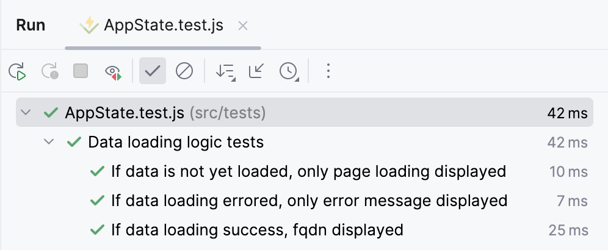

# Testové zadání pro CZ.NIC 

Cílem tohoto úkolu bylo vytvořit webovou stránku s detaily fiktivní domény neviditelna-univerzita.cz v Vue.js.

## Tech Stack 


**[UI library PrimeVue](https://primevue.org/)**  
**[CSS Utility PrimeFlex](https://primeflex.org/)**  
**[State management Pinia](https://pinia.vuejs.org/)**  

## Features

1) Použito Vue 3 s dodržením **Priority A: Essential** a některých **Priority B - Strongly Recommended**.
1) Vytvořen responzivní design aplikace (mobile - 320px; tablet - 768px; desktop - 1024px).
1) Webová stránka s detaily má dva režimy - stručný a podrobný. 
1) Po kliknutí na tlačítko "Zobrazit" v řádku AuthInfo je zobrazeno tajné heslo. 
1) Po kliknutí na uživatelské jméno v pravém horním rohu stránky se zobrazí uživatelské menu.
1) Implementované příklady testů s Vitest, `@testing-library/vue` a `@pinia/testing`



## Project Setup

```sh
npm install
```

### Compile and Hot-Reload for Development

```sh
npm run dev
```

### Run tests

```sh
npm run test
```

### Type-Check, Compile and Minify for Production

```sh
npm run build
```
